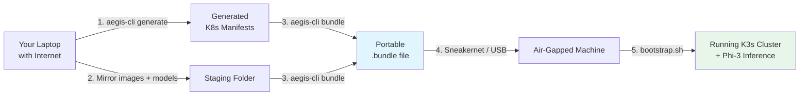

# Project Aegis

> **The "last mile" problem of AI infrastructure**: How do you reliably deploy and run a real AI model in a place with **no internet**?

Aegis solves this with a **deterministic, profile-driven deployment engine** that packages everything (code, models, containers) into a portable bundle you can carry on a USB stick into a restricted or air-gapped environment.

---

## What is Aegis? (For Newcomers)

Think of it like this:

- You have a powerful but **tiny** AI model (Microsoft Phi-3 mini, 3.8 billion parameters).
- You want to run it on a cheap GPU (NVIDIA T4) inside a locked-down location (no internet allowed).
- You need to prove it works **without ever touching the public internet** after deployment.

Aegis gives you a repeatable way to:
1. Define what you want using simple YAML **profiles**
2. Automatically generate all the Kubernetes files
3. Bundle models + container images into one portable file
4. Deploy it (even on a fresh machine with zero internet)

**Core promise**: Once the bundle is on the target machine, the AI will keep working even if you cut the network cable.

---

## High-Level Flow (Mermaid Diagram)



**Key Components:**

- **Generator** (`aegis-cli`): Turns a profile into real Kubernetes YAMLs
- **Mission Control**: A small FastAPI app that is the *only* thing allowed to talk to the AI model
- **Bundle**: One file containing everything needed to run offline

---

## Quick Start (New Developer)

```bash
# 1. Build the CLI
go build -o aegis-cli ./cmd/aegis-cli

# 2. List available setups (profiles)
./aegis-cli profiles list

# 3. Generate everything for a demo on GCP
./aegis-cli generate --profile gcp-demo --out ./out/gcp-demo

# 4. (Optional) Create a fully portable offline bundle
./aegis-cli bundle --profile airgap-sim --out aegis.bundle
```

See the **[Complete Beginner Tutorial](grok-build-tutorial.md)** if you're new to this kind of tooling.

---

## Success Criteria (How We Know It Works)

After everything is deployed in the locked-down environment, you must be able to run one command from inside the cluster and get:

1. ✅ GPU is visible (`nvidia-smi` works)
2. ✅ The AI model was loaded from local disk (never downloaded from the internet)
3. ✅ You get a useful answer back, and **zero traffic** left the machine to the outside world

---

## Documentation for Different People

| Who are you?                          | Start Here                                      |
|--------------------------------------|-------------------------------------------------|
| **I have 5 minutes**                 | [QUICKSTART.md](QUICKSTART.md)                  |
| **Complete newbie**                  | [grok-build-tutorial.md](grok-build-tutorial.md) |
| **Want to try it quickly**           | [docs/ONBOARDING.md](docs/ONBOARDING.md)        |
| **Need exact commands**              | [docs/RUNBOOK.md](docs/RUNBOOK.md)              |
| **Want to understand the long plan** | [docs/PLAN.md](docs/PLAN.md)                    |
| **Working on the code**              | [AGENTS.md](AGENTS.md)                          |
| **Testing / Validation**             | [TESTING.md](TESTING.md)                        |

**Diagram Sources**: All Mermaid diagrams live as editable source files in [`docs/diagrams/`](docs/diagrams/). Regenerate PNG/SVG versions anytime at [mermaid.live](https://mermaid.live).

---

## Current Status (May 2026)

- **Phases 1–4**: Complete (including true zero-internet "golden images")
- **Phase 5**: Code complete — you can now choose between **Ollama** or **vLLM** as the inference engine using the same system
- **Phase 6+**: Early design work started (multi-node clusters)

See [docs/PLAN.md](docs/PLAN.md) for the full roadmap.

---

## Requirements (Developer Machine)

- Go 1.23+
- Python 3.11+
- Docker (to export container images)
- (Optional) GCP account with T4 GPU quota for full end-to-end testing

---

**License**: Internal demo / proof-of-concept. Not intended for production without security review.
