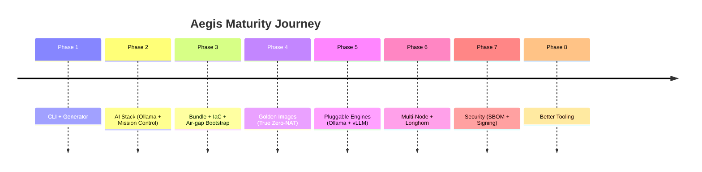

# Project Aegis — Implementation Roadmap

> **New here?** This page is the technical plan.  
For a gentler introduction, read:
- [QUICKSTART.md](../QUICKSTART.md) (5-minute explainer)
- [README.md](../README.md)

**Current Status (May 2026)**
- Phases 1–4: Complete
- Phase 5: Code complete (Ollama + vLLM both work via the same system)
- Phase 6: Early scaffolding (multi-node + Longhorn)

**Date:** 2026-05 (initial build)  
**Repo Root:** `/aegis` (this workspace)

### Phases at a Glance



## Defined Phases (Inferred from req.md + Practical PoC Constraints)

### Phase 1: CLI Foundation & Profile-Driven Generator (Core "Generator")
**Goal:** Working `aegis-cli` binary that:
- Loads YAML profiles (`gcp-demo`, `airgap-sim`)
- Uses `go:embed` to bundle static manifests, scripts, and templates
- `generate` command renders final K8s YAMLs + bootstrap scripts tailored to profile (e.g., GPU node selector for gcp-demo, bundle-only paths for airgap-sim)
- `version`, `profiles list`, `validate` subcommands
- Deterministic: same profile + same embed = identical output

**Key Deliverables (this phase):**
- `cmd/aegis-cli/main.go` + Cobra CLI
- `internal/profiles/` : profile structs + loader + defaults
- `internal/generator/` : renderer using text/template or yaml merge + embed.FS
- Embedded FS: `manifests/k8s/*.yaml`, `scripts/bootstrap/*.sh` (template-able)
- `profiles/gcp-demo.yaml`, `profiles/airgap-sim.yaml`
- Basic `aegis-cli generate --profile gcp-demo --out ./out/`

**Tech:**
- Go 1.23+
- `github.com/spf13/cobra`
- `gopkg.in/yaml.v3`
- `text/template` for light rendering (image tags, resource limits per profile)

**Exit Criteria:** `go run ./cmd/aegis-cli generate --help` works and produces output files.

---

### Phase 2: Low-Power AI Stack & Containerized Workloads (The "Workflow")
**Goal:** Complete, self-contained AI inference + orchestration layer that runs 100% locally.

**Components:**
1. **Inference Server:** Ollama (container `ollama/ollama:latest`) running `phi3:mini` (3.8B, 4k ctx). 
   - Why Ollama vs vLLM: Simpler air-gap model loading (blob dir copy), excellent T4/CUDA support, OpenAI-compatible `/v1` API.
2. **Mission Control API (Python):** FastAPI service (`mission-control/`)
   - Endpoints: `POST /query` (simple JSON { "prompt": "..." }), `GET /health`, `GET /model-info`
   - **Strictly no external calls**: Only forwards to `http://ollama:11434/api/generate` or `/v1/chat/completions` inside cluster.
   - Returns "Mission Update" style responses (demo flavor text).
   - Containerized with its own Dockerfile.
3. **Local Registry (Zot):** `ghcr.io/project-zot/zot:latest` (minimal OCI registry). Deployed for completeness + future image serving. (Images primarily pre-imported to containerd for speed.)
4. **GPU Support:** NVIDIA Device Plugin for K8s + node labels/taints for GPU workloads.
5. **K8s Manifests (all in `manifests/k8s/`):**
   - `namespace.yaml`
   - `ollama-deployment.yaml` (with GPU limits, model volume)
   - `mission-control-deployment.yaml` + Service
   - `zot-registry.yaml` (optional)
   - `nvidia-device-plugin.yaml` (DaemonSet from NVIDIA)
   - `networkpolicy.yaml` (deny egress except DNS + intra-ns for demo)
   - `kustomization.yaml` or plain yamls for simplicity

**Model Bundling Strategy (Phase 2+3):**
- Connected stage: `docker run -v ./staging/models:/root/.ollama ollama/ollama ollama pull phi3:mini`
- Tar the model dir → included in `.bundle`
- Bootstrap on target mounts it as hostPath /opt/aegis/models → container /root/.ollama ; Ollama auto-detects.

**Python Tech:**
- FastAPI + uvicorn + httpx (for local calls only)
- `mission-control/requirements.txt`
- Dockerfile that produces small image.

**Exit Criteria (Phase 2):** 
- `kubectl apply -f manifests/k8s/` succeeds conceptually
- Mission Control pod + Ollama pod scheduled with `nvidia.com/gpu: 1`
- Local curl to mission-control returns Phi-3 generated text (simulated in unit test if no GPU)

---

### Phase 3: Dependency Bundling, IaC & Air-Gap Bootstrap (The "Foolproof" Pipeline)
**Goal:** One-command (or few) path from connected workstation → fully air-gapped GCP VM running the stack.

**Sub-Parts:**

#### 3.1 Bundle Pipeline (`scripts/bundle/` + CLI integration)
- `bundle.sh` or Python `bundler.py`: 
  - Pulls required OCI images: `ollama/ollama`, `ghcr.io/project-zot/zot`, `nvcr.io/nvidia/k8s-device-plugin` (or official `registry.k8s.io/nvidia-gpu-device-plugin`)
  - `docker save | gzip` → `staging/images/`
  - Downloads K3s airgap assets if possible (`k3s` binary + optional images tar from https://github.com/k3s-io/k3s/releases but for demo we document `curl -sfL https://get.k3s.io | INSTALL_K3S_SKIP_DOWNLOAD=true ...` + pre-cache)
  - Runs Ollama pull into `staging/models/`
  - Generates `manifests/bundle-manifest.json` with SHA256 for **every** file
  - `aegis-cli bundle --profile airgap-sim --staging-dir ./staging --out ./aegis-v1.bundle` (tar.gz + checksum sidecar)
- Verification command: `aegis-cli verify-bundle aegis-v1.bundle`

#### 3.2 Infrastructure as Code (`iac/pulumi/`)
- Pulumi Go program (`Pulumi.yaml` + `main.go`)
- Resources created:
  - GCP Project (assumes existing or creates)
  - VPC + Subnet (regional, private)
  - Cloud NAT (for **initial** bootstrap only - documented removal step)
  - Firewall rules (SSH, internal k8s, API access)
  - Compute Instance: `n1-standard-4` + 1x `nvidia-tesla-t4` (guest accelerator)
    - Boot disk: Ubuntu 22.04 LTS minimal
    - Optional: attached Persistent Disk (`aegis-bundle-disk`) for the `.bundle` (large disk)
  - Service Account with minimal perms
- **cloud-init / startup-script** (embedded or generated):
  - Partition + mount extra disk if used
  - `apt-get` for base packages (build-essential, curl, ca-cert, containerd prerequisites) — runs while NAT is present
  - Install NVIDIA drivers + CUDA toolkit (via `ubuntu-drivers autoinstall` + NVIDIA CUDA repo key; **this step requires internet**)
  - Install K3s (airgap-friendly flags: `--docker=false --container-runtime-endpoint ...` or standard + image preload dir `/var/lib/rancher/k3s/agent/images/`)
  - Copy/extract bundle from attached disk or `/opt/aegis`
  - Run `bootstrap.sh` (from bundle):
    - Import all `images/*.tar` via `ctr -n k8s.io image import`
    - Untar models into `/opt/aegis/models`
    - Write `/etc/rancher/k3s/config.yaml` + registries if Zot used
    - `systemctl enable --now k3s`
    - `kubectl apply -f /opt/aegis/manifests/`
    - Wait for pods ready, run smoke test
- **Post-bootstrap air-gap simulation step** (manual or script): `gcloud compute instances remove-access-config` or delete Cloud NAT router + confirm via VPC flow logs or `tcpdump` that no unexpected egress occurs during inference.

**Note on Drivers:** Full zero-internet driver install is hard (NVIDIA .run files are 500MB+). For demo we:
- Document GCP "installable" driver path (initial NAT window)
- Provide alternative: "use a pre-baked custom image with drivers + k3s preinstalled" (future Phase 4)

#### 3.3 CLI Integration for Deploy
- `aegis-cli deploy --profile gcp-demo` (thin wrapper that invokes `pulumi up` with stack config + passes generated manifests + bundle path)
- Or separate: user runs Pulumi directly after `aegis-cli generate`

**Exit Criteria (Phase 3):**
- `aegis-cli bundle ...` produces a verifiable `.bundle` with checksums
- Pulumi program `pulumi preview` succeeds (with valid GCP creds)
- `docs/RUNBOOK.md` contains exact commands to go from `go run ./cmd/aegis-cli generate` → GCP VM SSH → `curl http://mission-control...` answering a "Mission Update" query using only local compute.

---

## Cross-Cutting Decisions & Trade-offs

| Area                  | Choice                          | Rationale / Trade-off |
|-----------------------|---------------------------------|-----------------------|
| Inference             | Ollama (phi3:mini)             | Easiest model air-gap (dir copy), OpenAI compat, mature CUDA on T4 |
| K8s Distro            | K3s (single-node)              | Lightweight, excellent airgap support docs, low RAM/CPU for edge sim |
| Registry              | Zot (deployed) + ctr import    | Meets "Local Image Registry (Zot)" req; ctr import gives fast pod startup |
| IaC                   | Pulumi (Go)                    | Same language as CLI; modern, good GCP support; can embed generator later |
| Bundle Format         | `.tar.gz` + `SHA256SUMS`       | Simple, verifiable with `sha256sum -c`, portable |
| Model Weights         | Ollama blob dir tar            | ~2.5GB for phi3:mini; fits T4 16GB VRAM easily (quantized by Ollama) |
| GPU Driver Strategy   | Initial-NAT + apt/cuda + docs for custom image | Pragmatic for demo; true air-gap image baking is separate concern |
| Mission Control       | FastAPI (Python 3.11 slim)     | Tiny, async, easy to show "no external egress" in code review |
| Validation            | `e2e-validate.sh` + kubectl exec | Runs the 3 success criteria from section 4 of req.md |

## Repository Layout (Final Target)

```
/aegis
├── cmd/aegis-cli/
│   └── main.go                 # Cobra root + subcommands (generate, bundle, verify, deploy)
├── internal/
│   ├── profiles/               # YAML unmarshal + validation
│   ├── generator/              # EmbedFS + template rendering engine
│   └── embed/                  # //go:embed directives (manifests, scripts, profiles)
├── manifests/
│   └── k8s/                    # All raw + template yamls (ollama, mission-control, etc.)
├── mission-control/
│   ├── app.py                  # FastAPI
│   ├── Dockerfile
│   └── requirements.txt
├── scripts/
│   └── bundle/
│       ├── mirror-images.sh
│       ├── prepare-models.sh
│       └── bundler.py
├── iac/
│   └── pulumi/
│       ├── Pulumi.yaml
│       ├── go.mod
│       └── main.go             # GCP resources + cloud-init user-data generator
├── docs/
│   ├── PLAN.md                 # This file
│   ├── TESTING.md              # End-to-end test/QA/eval plan + Phase 5 matrix
│   ├── grok-build-usage.md     # Effective prompting patterns for Grok Build TUI
│   ├── RUNBOOK.md              # Exact operator commands for demo
│   └── architecture.md
├── AGENTS.md                   # AI agent rules & project conventions (read by Grok/Claude/etc.)
├── grok-build-tutorial.md      # Complete tutorial for the Grok Build TUI
├── grok-build-usage.md         # Effective prompting patterns (companion to the tutorial)
├── profiles/                   # Source YAML profiles (copied into embed)
├── go.mod
├── README.md
└── requirements.md             # Original (req.md copied here)
```

## Phase Completion Order (This Session)

1. **Scaffolding + Phase 1** (CLI + profiles + generator + embedded hello world manifests)
2. **Phase 2** (Full manifests + Mission Control Python + Ollama deployment yaml)
3. **Phase 3** (Bundle scripts + checksum + basic Pulumi skeleton + bootstrap.sh + RUNBOOK)

After Phase 3 we will have a **minimum viable PoC** that a developer with GCP + T4 quota + NVIDIA account can execute end-to-end (modulo driver install time).

## Phase Completion Status (May 2026)

| Phase | Status     | Key Deliverables |
|-------|------------|------------------|
| 1     | ✅ Done    | CLI, profiles, generator, go:embed |
| 2     | ✅ Done    | Full K8s manifests, Mission Control FastAPI, Ollama |
| 3     | ✅ Done    | Bundle pipeline, Pulumi IaC, bootstrap, RUNBOOK |
| **4** | **✅ Done** | **Golden Image (Packer + 5 provisioners), gcp-hardened profile, zero-NAT Pulumi support, comprehensive ONBOARDING.md with 5 professional diagrams** |
| **5** | **Code Complete** | **Pluggable vLLM + Ollama (unified OpenAI /v1), gcp-vllm profile, engine-aware everything, T4-tuned defaults. Real runtime validation on hardware is the last step.** |
| **6** | **Scaffolded** | **Multi-node K3s + Longhorn distributed storage** (profile draft + generator support started) |

## Phase 5: Pluggable Inference Backends (vLLM + Quantization) — IN PROGRESS
**Status:** Started post-Phase 4 (May 2026). Core goal: make inference engine first-class (ollama | vllm), with profile-driven selection, unified Mission Control, and air-gap model prep for both.

**Goal:**
- Allow `inference.engine: "vllm"` (or "ollama") in any profile.
- vLLM deployment with OpenAI-compatible API, local HF weights, suitable args for T4 (16GB) + Phi-3 or other quants.
- Single Mission Control that speaks OpenAI /v1 to either backend (no engine-specific code in API layer).
- Quantization profiles (e.g. 4bit via Ollama q4_0, or vLLM --quantization, or GGUF via llama.cpp fallback later).
- Preserve 100% backward compat for existing ollama profiles.
- Bundle + bootstrap scripts detect engine and stage correct image + weights.

**Key Architecture Decisions:**
- Inference service/deployment name abstracted via `{{ .InferenceServiceName }}` (ollama or vllm) but we standardize on "inference" label + per-engine service for clarity.
- All inference pods get common label `aegis/component: inference` for NetworkPolicy + discovery.
- Mission Control env: `INFERENCE_ENGINE`, `INFERENCE_URL`, `MODEL_NAME`. Uses only `/v1/chat/completions` + `/v1/models`.
- Model storage convention:
  - ollama: /opt/aegis/models  (Ollama blob layout)
  - vllm: /opt/aegis/models/<model-slug>/  (HF snapshot with config.json + *.safetensors)
- prepare-models.sh becomes engine-aware (calls different downloaders).
- New profile: `gcp-vllm` (and `airgap-vllm-sim` later) demonstrating vLLM on T4 with appropriate quant.

**Deliverables (Phase 5 MVP):**
- [x] Extended `Profile.Inference` + `RenderContext` with Engine, ServiceName, Port, Quant
- [x] `manifests/k8s/vllm-deployment.yaml.tpl` (T4-friendly defaults, local HF weights, OpenAI compat)
- [x] Updated kustomization, bootstrap.sh, mission-control templates with conditionals
- [x] Mission Control refactored for dual-backend (OpenAI unified /v1 path)
- [x] Engine-aware `mirror-images.sh` + `prepare-models.sh` (robust HF snapshot for vLLM)
- [x] New `profiles/gcp-vllm.yaml` with T4 quantization guidance + updated docs
- [x] `aegis-cli generate --profile gcp-vllm` produces valid manifests
- [x] TESTING.md created with full E2E/QA/eval plan + Phase 5 test matrix
- [x] Polish pass on vLLM path (prepare script robustness, T4 defaults, profile guidance) — May 2026

**Tech Notes:**
- vLLM image: `vllm/vllm-openai:latest` (or `ghcr.io/vllm-project/vllm-openai:latest` for stability)
- For T4 + phi3-mini-4k: use `--max-model-len 2048 --gpu-memory-utilization 0.85 --trust-remote-code`. Full fp16 works; 4-bit via bitsandbytes or pre-quantized AWQ model recommended for headroom.
- Quantization field in profile now drives CLI flags in the generated deployment (e.g. vllm args or ollama quant in model name).
- TensorRT-LLM deferred to Phase 5.2 (requires more complex build, TensorRT engine export).

**Exit Criteria:**
- Both `gcp-demo` (ollama) and `gcp-vllm` generate + `kubectl apply` conceptually valid.
- Mission Control /query works identically against either backend in the cluster.
- Bundle includes correct inference image for chosen engine.
- No regressions in Phase 1-4 flows.

---
## Phase 6: Multi-Node K3s Cluster + Longhorn Distributed Storage — NOT STARTED

**Goal:**
Enable true multi-node deployments of Aegis for higher availability, larger aggregate GPU capacity, and production-like edge clusters while preserving the air-gap and profile-driven philosophy.

**Key Challenges for Multi-Node in Air-Gap Context:**
- K3s cluster formation (server + agent nodes) must be fully air-gappable (token distribution, no external discovery).
- Workload placement: Inference pods should run on GPU nodes; control-plane components should be schedulable on non-GPU nodes if desired.
- Persistent storage for models must be available on all GPU nodes → Longhorn (or similar) becomes necessary.
- Bundle + bootstrap process must support "join an existing cluster" vs "bootstrap a new cluster".
- NetworkPolicy, Service discovery, and DNS must work across nodes.

**Proposed Architecture Decisions:**
- Add `target.cluster_mode: "single-node" | "multi-node"` (or repurpose `k3s.k3s_mode`).
- New profile family: `gcp-multi.yaml`, `airgap-multi.yaml`.
- Separate node roles via labels:
  - `aegis/node-role: control-plane`
  - `aegis/node-role: gpu-worker`
- Longhorn deployed as the default StorageClass for model PVCs (instead of hostPath).
- K3s installation split: first node = server, subsequent nodes = agents that join via a pre-shared token embedded in the bundle.
- Generator produces different bootstrap scripts or a `join.sh` for worker nodes.
- Inference deployments get stronger node affinity / anti-affinity rules.

**Deliverables (Phase 6 MVP):**
- [x] Detailed design doc / section in PLAN.md (this section)
- [x] Extend `Profile.Target` + generator `RenderContext` with `ClusterMode`
- [x] New profile scaffold: `profiles/gcp-multi.yaml`
- [ ] Longhorn deployment manifest template (or conditional inclusion)
- [ ] Updated bootstrap/join scripts that support multi-node K3s cluster formation from the bundle
- [ ] Example Pulumi or manual instructions for provisioning 1 control + 2 GPU workers on GCP
- [ ] Update TESTING.md with multi-node validation matrix
- [ ] End-to-end test: 3-node cluster boots, inference runs on a worker, Longhorn volume is used for models

**Tech Notes:**
- Longhorn requires a minimum of 3 nodes for HA (or can run in non-HA mode on 2).
- For T4 edge use cases, many deployments will be 1 control + 1–3 GPU workers.
- Model PVCs will move from `hostPath` to `Longhorn` `StorageClass`.
- K3s embedded etcd (or external etcd) considerations for >1 server.

**Exit Criteria:**
- User can run `aegis-cli generate --profile gcp-multi` and get manifests that conceptually deploy to a multi-node K3s cluster.
- A 3-node cluster (1 control + 2 workers) can be stood up from a single bundle.
- Inference workloads land on GPU-labeled nodes.
- Models are served from Longhorn-backed PVCs.

---

## Future Phases (Post 6)
- Phase 7: SBOM + signed bundles + cosign + SBOM verification in bootstrap
- Phase 8: Web UI for bundle inspection + one-click validation reports  ✅ (implemented as `aegis-cli inspect`)

---

**Implementation Notes for Agent:**
- Prioritize working `go build` and `python -m uvicorn` over perfect production polish.
- Every generated file must be usable immediately (`go run`, `docker build`, `pulumi preview`).
- Include generous comments + example "Mission Update: ..." prompts in Mission Control.
- No external API keys or internet-dependent code paths in the runtime containers.
- All large assets (models, images) are generated on-demand during `bundle` step (never committed to git).

This plan is now the source of truth for the build. Proceed to code.
